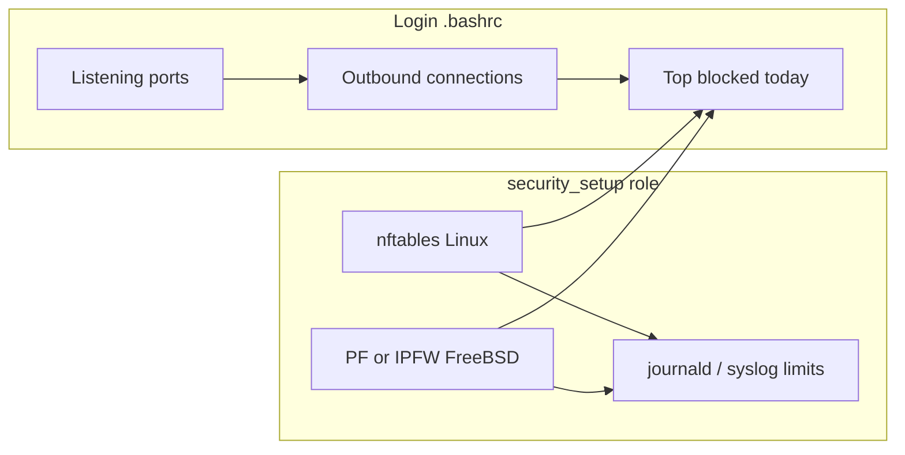

# Login visibility and security_setup role

## 1. Login flow: two new blocks in .bashrc (after listening ports)

**Location:** [files/.bashrc](files/.bashrc) — insert immediately after the existing "OS-aware listening ports display" block (after line 707, before the final `echo ""`), reusing the same OS-detection pattern already used there: Debian/Ubuntu or RHEL (`/etc/debian_version` or `/etc/redhat-release`), FreeBSD (`/etc/freebsd-update.conf` or `uname -s | grep -q FreeBSD`), and a generic fallback.

### 1.1 Active outbound connections

- **Debian / RHEL (Linux):** Use `ss -tnp` (both have iproute2). Show header + ESTAB lines, exclude peer port 22 to reduce clutter:  
`ss -tnp 2>/dev/null | awk 'NR==1 || ($1=="ESTAB" && $5 !~ /:22$/)' | head -10`  
(Column 5 is Peer Address:Port; excluding destination port 22.)
- **FreeBSD:** Use `netstat -an`. Filter ESTABLISHED and exclude foreign address ending in `.22`:  
`netstat -an 2>/dev/null | awk '/ESTABLISHED/ && $5 !~ /\.22$/' | head -10`  
(No header from netstat -an by default; optionally print a one-line header before.)
- **Fallback (other):** `netstat -an 2>/dev/null | grep -i estab | head -10` or equivalent; if `ss` exists, prefer `ss -tnp` with the same awk logic as Linux.

### 1.2 Top blocked connection attempts (today)

- **Debian / RHEL (Linux):** When the firewall is nftables (as in the new security_setup role), kernel logs go to journald. Use:  
`sudo journalctl -k --since today 2>/dev/null | grep "nftables-drop-out" | grep -oP 'DST=\K[0-9.]+' | sort | uniq -c | sort -rn | head -5`  
Fallback when no drops or no nftables: `echo "No drops today"`.  
RHEL has journalctl; the same command works there once nftables is in use.
- **FreeBSD:** No journalctl. Logs go to syslog (e.g. `/var/log/messages` or `/var/log/auth.log`). The security_setup role will use a fixed log prefix for outbound drops (e.g. `"ipfw-drop-out"` or `"pf-drop-out"`). In .bashrc: parse today's log (e.g. with `date +"%b %e"` for syslog timestamp), grep that prefix, extract destination IP with a POSIX or OS-appropriate regex (avoid `grep -oP` if not available; use `sed` or `awk`), then `sort | uniq -c | sort -rn | head -5`. If no matches or no log: `echo "No drops today"`.
- **Fallback:** If we can't detect a known firewall log format, print a single line like "No drops today" or "Blocked stats not available".

**Implementation note:** The "top blocked" block only makes sense when a firewall that logs drops is present. You can either always run it (and show "No drops today" when there are no matching logs) or gate it (e.g. only when a marker file or specific log exists). Always running and degrading to "No drops today" is simpler and stays consistent across OSes.

---

## 2. New role: security_setup

**Purpose:** Install and configure the appropriate stateful firewall per OS with default-deny inbound/outbound, allow SSH from configurable subnets, allow DNS/DHCP and selected outbound (e.g. HTTP/HTTPS, SSH), and log outbound drops to the primary log system. Enforce log limits: 500MB total size and 2-week retention.

**Role layout:**

- `roles/security_setup/`
  - `tasks/main.yml` — main flow: set OS facts, include OS-specific task file (e.g. `tasks/linux_nftables.yml`, `tasks/freebsd_pf.yml` or `freebsd_ipfw.yml`), configure log limits (journald on Linux, newsyslog/syslog on FreeBSD).
  - `templates/` — OS-specific firewall config templates (Jinja2) with variables for `ssh_allowed` (list or CIDR), `dns_servers` (list of IPs), and any other knobs.
  - `defaults/main.yml` — default values for `security_ssh_allowed_networks`, `security_dns_servers`, and any other role variables. No hardcoded 172.16.x; those become overridable via group_vars or host_vars.

**OS strategy:**

| OS      | Firewall   | Notes                                                                                                                                                   |
| ------- | ---------- | ------------------------------------------------------------------------------------------------------------------------------------------------------- |
| Debian  | nftables   | Default on modern Debian; no need to disable another stack.                                                                                             |
| RHEL    | nftables   | Use nftables directly; disable and mask firewalld so it's the single authority.                                                                         |
| FreeBSD | PF or IPFW | FreeBSD has no single default. Choose one (e.g. PF for OpenBSD-style docs and logging). Implement one first; the other can be added later as an option. |

**Firewall semantics (aligned with your nftables example):**

- **Input:** default drop; allow established/related; loopback; drop invalid; allow SSH only from `ssh_allowed`; allow DHCP client (udp 67→68); counter drop for the rest.
- **Forward:** default drop (no forwarding).
- **Output:** default drop; allow established/related; loopback; allow DNS to `dns_servers` (udp/tcp 53); DHCP client (68→67); allow outbound TCP 80, 443, 22; **log and drop** everything else with a **fixed prefix** (e.g. `nftables-drop-out` on Linux, `pf-drop-out` or `ipfw-drop-out` on FreeBSD) so the .bashrc "top blocked" block can parse it.

**Logging and retention:**

- **Linux (Debian/RHEL):** Log to kernel (journald). In the role, deploy a drop-in under `/etc/systemd/journald.conf.d/` (e.g. `security_setup.conf`) with:
  - `SystemMaxUse=500M`
  - Time-based retention: `MaxAge=14d` (or equivalent; exact key from `journald.conf(5)`).
- **FreeBSD:** Firewall logs to syslog. Use **newsyslog** (or logrotate if present) to rotate the relevant log file(s) with a max size (e.g. 500MB total or per-file) and retention (e.g. 14 days). Configure syslog so firewall log lines use a single, predictable prefix for the "top blocked" parser in .bashrc.

**Ordering and playbook:**

- Add `security_setup` as a new role in [playbooks/site.yml](playbooks/site.yml) (e.g. after `login_setup`). Ensure `security_setup` runs after `tools_setup` (and any SSH hardening) so SSH access from allowed subnets is already in place.
- Make the role **optional** or **skippable** (e.g. `when: security_setup_enabled | default(false)` or a similar variable) so existing playbook runs don't enable a firewall by default until desired.

**RHEL:** Ensure the role disables and masks firewalld before loading nftables rules, and enables the nftables service so rules persist across reboots.

**FreeBSD:** Enable the chosen firewall in `rc.conf` (e.g. `pf_enable="YES"` and `pf_rules="/etc/pf.conf"`), deploy the rules file from a template, and reload the firewall. Align log format and prefix with what .bashrc expects for "top blocked (today)".

---

## 3. Dependency: .bashrc "top blocked" and security_setup

The "top blocked" snippet in .bashrc assumes a known log prefix and destination format:

- **Linux:** `nftables-drop-out` and `DST=x.x.x.x` in kernel logs (journalctl).
- **FreeBSD:** Same idea: a fixed prefix and a parseable destination IP in the log line (to be defined in the security_setup template and documented so the .bashrc parser can use one regex per OS).

Implement security_setup first (including log prefix and retention), then add the two .bashrc blocks so the "top blocked" command matches the actual log format on each OS.

---

## 4. Interactive questions for security_setup (setup_remote.sh and setup_local.sh)

**Shared behavior:** Both scripts ask the same three items (Enable firewall?, SSH allowed ranges, DNS servers) and pass the same extra-vars to the playbook. Use the same prompt text and option numbering so behavior is identical. Consider extracting the prompt logic into a shared function or keeping the same structure in both scripts for consistency.

**setup_remote.sh — Placement:** After the existing user questions and after MOTD. Order: `select_target_user` → `select_additional_sudo_users` → (SSH test) → `preview_motd`. Add the security_setup questions **immediately after `preview_motd`** (inside the SSH-success block, around line 239). Use the same style as the other prompts (blue section headers, read -p, green/yellow feedback).

**setup_local.sh — Placement:** [setup_local.sh](setup_local.sh) has no MOTD preview; it runs `select_target_user` → `select_additional_sudo_users` then the playbook. Add the same security_setup questions **immediately after `select_additional_sudo_users`** (around line 163), before the hosts.ini / sudo checks and the playbook run. Use the same blue headers and feedback style. Append the same three extra-vars to both `ansible-playbook` invocations (lines 196 and 199).

**Constants (in script):** Define defaults that match the role's `defaults/main.yml` so prompts and behavior stay in sync:

- `SECURITY_SSH_ALLOWED_DEFAULT="172.16.233.0/26 172.16.234.0/26"`
- `SECURITY_DNS_SERVERS_DEFAULT="172.16.234.16 172.16.234.26"`

### 4.1 SSH inbound source ranges

- **Prompt:** e.g. "SSH allowed source ranges (CIDR)" with a short explanation.
- **Option 1 (default):** Use the default ranges: `172.16.233.0/26 172.16.234.0/26`. Store in a variable used later for Ansible (e.g. `SECURITY_SSH_ALLOWED`).
- **Option 2:** User enters custom ranges in the form `172.16.233.0/26 10.0.0.0/24` (space-separated). This **replaces** the defaults (no merging). Validate minimally (non-empty, plausible CIDR tokens); on invalid input, re-prompt or fall back to defaults and inform the user.
- Result: `SECURITY_SSH_ALLOWED` is a space-separated string passed to Ansible as `security_ssh_allowed_networks` (role will split into a list).

### 4.2 DNS servers (follow-up)

- **Prompt:** "DNS servers for firewall allow list" (or similar). **Show the default list** from the config: "Current defaults: 172.16.234.16, 172.16.234.26" (or the same values as in the role defaults).
- **Option 1 (default):** Use these defaults. Set `SECURITY_DNS_SERVERS` to the default string.
- **Option 2:** User enters custom DNS server IPs (space-separated, e.g. `172.16.234.16 172.16.234.26 8.8.8.8`). This **replaces** the defaults. Optional: basic IP format check.
- Result: `SECURITY_DNS_SERVERS` is a space-separated string passed to Ansible as `security_dns_servers` (role will split into a list).

### 4.3 Enabling the role and passing vars

- **When to ask:** Only ask the two questions above if the user is going to run security_setup. Add a single preceding question: **"Enable firewall (security_setup role)? [y/N]"**. If the user chooses **No**, set `SECURITY_SETUP_ENABLED="false"` and **do not** ask SSH ranges or DNS; set `SECURITY_SSH_ALLOWED` and `SECURITY_DNS_SERVERS` to the defaults (or empty) so the role still receives valid vars if it's run conditionally. If **Yes**, then ask SSH ranges (4.1) and DNS servers (4.2), and set `SECURITY_SETUP_ENABLED="true"`.
- **Ansible:** In **setup_remote.sh**, append to the existing `--extra-vars` in both playbook invocations (around lines 339 and 341). In **setup_local.sh**, append to both invocations (lines 196 and 199). Same string in both scripts:  
`security_setup_enabled=$SECURITY_SETUP_ENABLED security_ssh_allowed_networks='$SECURITY_SSH_ALLOWED' security_dns_servers='$SECURITY_DNS_SERVERS'`  
Ensure quoting so space-separated values are passed as a single value (e.g. the role can split on spaces). The role's `when: security_setup_enabled | default(false)` (or similar) will skip the role when false.

**Summary:** One new "Enable firewall?" gate, then two prompts (SSH ranges with option 1 = default ranges / option 2 = custom replace; DNS with option 1 = listed defaults / option 2 = custom replace). All answers passed into the playbook as extra-vars. Apply the same flow in both setup_remote.sh and setup_local.sh.

---

## 5. Summary of files to add or change

- **[setup_remote.sh](setup_remote.sh):** After `preview_motd`, add: (1) "Enable firewall (security_setup)?"; (2) SSH allowed source ranges (option 1 = default `172.16.233.0/26 172.16.234.0/26`, option 2 = enter custom space-separated, replace); (3) DNS servers (show defaults, option 1 = use them, option 2 = enter custom, replace). Pass `security_setup_enabled`, `security_ssh_allowed_networks`, `security_dns_servers` in `--extra-vars`.
- **[setup_local.sh](setup_local.sh):** After `select_additional_sudo_users`, add the same three prompts (Enable firewall?, SSH ranges, DNS servers) and append the same `security_setup_enabled`, `security_ssh_allowed_networks`, `security_dns_servers` to both `ansible-playbook` `--extra-vars` lines.
- **[files/.bashrc](files/.bashrc):** Add two blocks after the listening-ports block: (1) "Active Outbound Connections" with Linux / FreeBSD / fallback, (2) "Top Blocked Destinations (today)" with journalctl for Linux and syslog parsing for FreeBSD, with fallback to "No drops today".
- **New role:** `roles/security_setup/` — tasks (main + Linux nftables + FreeBSD PF or IPFW), templates (nftables rules, PF or IPFW rules, journald drop-in, newsyslog config if needed), defaults for `security_ssh_allowed_networks` and `security_dns_servers` matching the script constants.
- **[playbooks/site.yml](playbooks/site.yml):** Add the `security_setup` role (gated by `security_setup_enabled` from extra-vars).
- **Docs:** Update [docs/playbooks.md](docs/playbooks.md) (and any architecture doc) to describe the new login output, the security_setup role, and the security_setup prompts in both setup_remote.sh and setup_local.sh.

---

## 6. Optional diagram (high level)

This plan keeps the login flow and firewall behavior consistent across Debian, RHEL, and FreeBSD. Implementation is complete; this document serves as project documentation.
